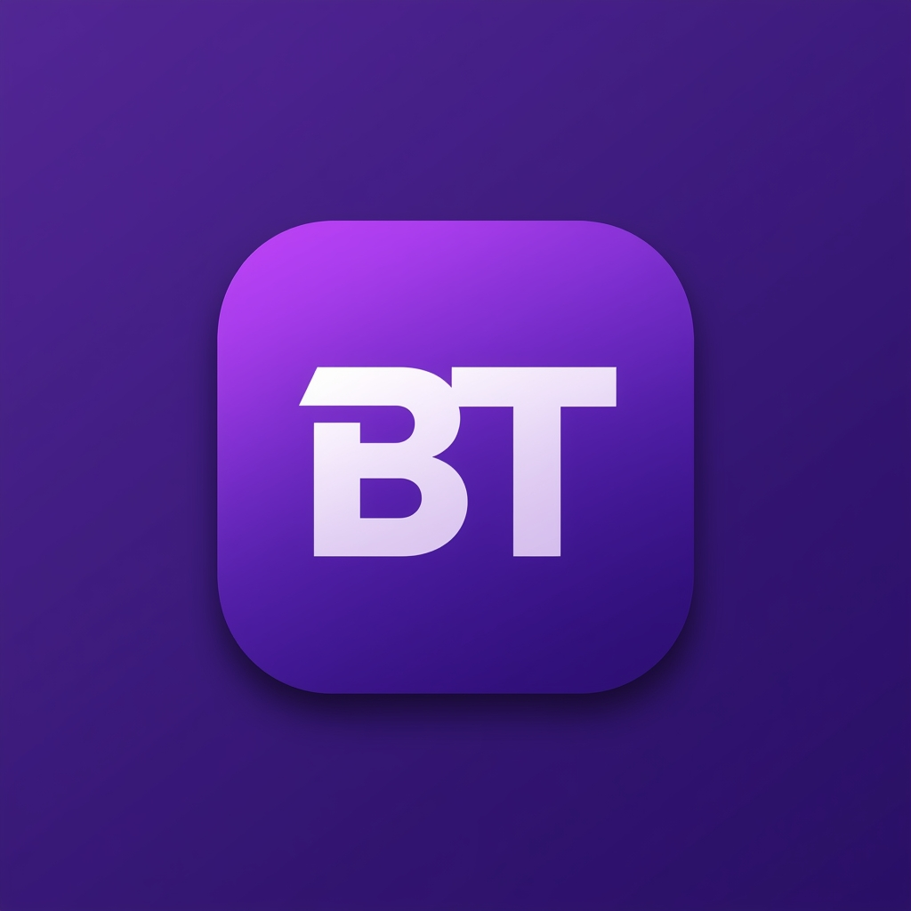

# Battle Test - Aplicación de Quizzes Educativos iOS

[](https://developer.apple.com/ios)
[](https://swift.org)
[](https://www.unam.mx)

Aplicación iOS de cuestionarios educativos con sistema de gamificación, soporte multiidioma y arquitectura MVC + Managers.

## 📋 Descripción

Battle Test es una aplicación móvil diseñada para fomentar el aprendizaje interactivo de estudiantes de secundaria y su preparación del examen de ingreso a nivel medio superior mediante quizzes educativos en tres idiomas (español, inglés y francés). Implementa un sistema completo de gamificación con 15 achievements categorizados, niveles, puntos y rachas de aciertos. Incluye persistencia local con UserDefaults, sincronización con backend REST y funcionalidad de compartir resultados en redes sociales.


## Logo y Branding

**Logo:** Iniciales "BT" (Battle Test) en un círculo con gradiente 
azul-morado (#4285F4 → #5C6BC0).

**Significado:**
- **Círculo:** Representa la completitud del conocimiento
- **Gradiente azul-morado:** Combina confianza (azul) con creatividad (morado)
- **Tipografía bold:** Transmite seriedad académica y confianza
- **Diseño minimalista:** Facilita reconocimiento en pantalla de inicio

**Paleta de colores:**
- Azul (#4285F4): Asignaturas científicas, elementos de UI
- Verde (#4CAF50): Logros, progreso, feedback positivo
- Naranja (#FF9800): Alertas, rachas, elementos de atención
- Modo oscuro: Adaptación automática preservando identidad visual

### Logo



##

## Justificación Técnica

**Dispositivos objetivo:** iPhone y iPad
**Razón:** 
- iPhone: Dispositivo personal principal de estudiantes de secundaria
- iPad: Uso en aulas y bibliotecas escolares, pantalla amplia ideal para estudio
- Consistencia de hardware y versiones de iOS en ecosistema Apple
- UI adaptativa que escala correctamente en ambos dispositivos

**Versión mínima de iOS:** 14.0
**Razón:** 
- Acceso a >95% de dispositivos iPhone y iPad activos
- APIs de networking modernas (NWPathMonitor para detección de conectividad)
- Soporte completo para modo oscuro automático
- Performance adecuado en dispositivos de 3+ años de antigüedad
- URLSession moderna con async/await support

**Versión objetivo de iOS:** 17.0
**Razón:** Testing en simuladores y dispositivos actuales con últimas características

**Orientaciones soportadas:** Portrait (vertical) únicamente
**Razón:**
- Experiencia educativa optimizada para lectura de cuestionarios
- Preguntas y opciones de respuesta más legibles en formato vertical
- Consistencia con apps educativas estándar (Duolingo, Khan Academy, Quizlet)
- Evita bugs de rotación durante ejecución de exámenes
- Interfaz uniforme en iPhone y iPad

## 📹 Video Demo

[](https://youtube.com/shorts/mHJ5VQk4kzE)

## ✨ Características Principales

- **🌍 Multiidioma:** Soporte completo para español, inglés y francés con localización automática
- **💾 Persistencia Local:** UserDefaults para progreso del usuario con sincronización instantánea
- **🎮 Gamificación Avanzada:** 15 achievements categorizados (velocidad, precisión, consistencia, explorador, perfeccionista)
- **🔄 Sincronización:** Integración con API REST alojada en Railway
- **📱 Offline-first:** Sistema de fallback local cuando no hay conexión
- **🎨 UI Nativa:** UIKit programático con soporte para modo oscuro/claro automático
- **📤 Compartir Resultados:** Captura de pantalla automática + texto personalizado para redes sociales

## 🏗️ Arquitectura

### MVC + Managers Pattern

```
┌──────────────┐
│ ViewControllers │
└───────┬────────┘
        │
┌───────▼────────┐
│   Managers     │ (Business Logic)
└───┬────────┬───┘
    │        │
┌───▼────┐ ┌─▼─────────┐
│UserDefs│ │ APIService│
└────────┘ └───────────┘
```

### Capas Implementadas

1. **Models (`Models/`)**
   - `Student.swift`: Modelo de usuario con XP, nivel, rachas
   - `Achievement.swift`: 15 achievements con criterios
   - `Quiz.swift`, `Question.swift`, `Subject.swift`
   - `QuizResult.swift`, `QuizSession.swift`

2. **Managers (`Managers/` + `Models/*Manager.swift`)**
   - `QuizEngine.swift`: Lógica de cuestionarios
   - `StudentManager.swift`: Progreso del usuario
   - `AchievementManager.swift`: Sistema de logros
   - `QuizDataManager.swift`: Datos locales + fallback
   - `UserProgressManager.swift`: Persistencia

3. **Network (`Network/`)**
   - `APIService.swift`: Retrofit-style networking
   - `NetworkMonitor.swift`: Detección WiFi/Cellular
   - `ConnectionBannerView.swift`: Feedback visual

4. **Views & Controllers (`ViewControllers/`, `Views/`)**
   - Tab Bar Navigation (Dashboard, Subjects, Profile)
   - Custom UIViews (CircularProgressView, AchievementGridView)
   - UIKit programático (NSLayoutConstraint)

## 🛠️ Tecnologías Implementadas

### Requisitos Módulos 4 y 5 - UNAM

| Requisito | Implementación | Estado |
|-----------|----------------|--------|
| **Launch Screen** | Configurado con Assets | ✅ |
| **App Icons** | 1024x1024 en Assets.xcassets | ✅ |
| **Modo Oscuro** | Automático según sistema | ✅ |
| **Navegación** | TabBarController + NavigationController | ✅ |
| **Multiidioma** | Localizable.strings (ES/EN/FR) | ✅ |
| **Detección Red** | NetworkMonitor con NWPathMonitor | ✅ |
| **Aviso Datos** | ConnectionBannerView automático | ✅ |
| **Backend** | Railway 24/7 con fallback offline | ✅ |

### Stack Tecnológico

- **Lenguaje:** Swift 5.9
- **UI:** UIKit (100% programático)
- **Persistencia:** UserDefaults
- **Networking:** URLSession + Codable
- **Arquitectura:** MVC + Managers
- **Navegación:** UITabBarController + UINavigationController
- **Localización:** NSLocalizedString + Localizable.strings

## 📂 Estructura del Proyecto

```
BattleTest_V1/
├── Extensions/
│   └── UIView+Screenshot.swift          # Captura de pantalla para compartir
│
├── Manager/
│   ├── AchievementManager.swift         # Sistema de logros
│   └── QuizEngine.swift                 # Lógica core de quizzes
│
├── Model/
│   ├── Achievement.swift                # Modelo de logros
│   ├── AppSettings.swift                # Configuración de app
│   ├── Quiz.swift                       # Modelo de cuestionario
│   ├── QuizDataManager.swift            # Datos locales + fetch API
│   ├── QuizResult.swift                 # Resultados de quiz
│   ├── QuizSession.swift                # Sesión activa de quiz
│   ├── Student.swift                    # Modelo de usuario
│   ├── Subject.swift                    # Modelo de asignaturas
│   └── UserProgressManager.swift        # Persistencia UserDefaults
│
├── Network/
│   ├── APIService.swift                 # Networking con Railway backend
│   └── NetworkMonitor.swift             # Detección WiFi/Cellular/Offline
│
├── Utilities/
│   └── ConnectionBannerView.swift       # Banner de estado de red
│
├── View/
│   ├── AchievementGridView.swift        # Grid de logros obtenidos
│   ├── CircularProgressView.swift       # Círculo de progreso animado
│   ├── PenaltyDotsView.swift            # Indicador de 3 errores
│   ├── QuestionView.swift               # Vista de pregunta con opciones
│   ├── StatsCardView.swift              # Tarjetas de estadísticas Dashboard
│   ├── SubjectCollectionViewCell.swift  # Celda de asignatura (grid)
│   └── WeeklyProgressChart.swift        # Gráfica de actividad semanal
│
├── ViewControllers/
│   ├── DashboardViewController.swift        # Tab 1: Dashboard gamificado
│   ├── MainTabBarController.swift           # Tab Bar principal (3 tabs)
│   ├── ProfileViewController.swift          # Tab 3: Perfil de usuario
│   ├── QuizListViewController.swift         # Lista de quizzes por materia
│   ├── QuizResultsViewController.swift      # Resultados + compartir
│   ├── QuizViewController.swift             # Quiz en ejecución
│   ├── RegistrationViewController.swift     # Registro inicial (primera vez)
│   └── SubjectsViewController.swift         # Tab 2: Grid de asignaturas
│
├── AppDelegate.swift                    # Configuración inicial de app
├── Assets.xcassets                      # Iconos, colores, imágenes
├── Info.plist                           # Configuración del proyecto
├── LaunchScreen.storyboard              # Pantalla de inicio
├── Localizable.strings                  # Strings localizables
│   ├── Localizable.strings (English)    # Traducciones inglés
│   ├── Localizable.strings (Spanish)    # Textos español (base)
│   └── Localizable.strings (French)     # Traducciones francés
├── LocalizationHelper.swift             # Helper para localización
├── Main.storyboard                      # Storyboard principal (mínimo)
└── SceneDelegate.swift                  # Manejo de escenas y navegación
```

## 🔄 Flujo de Datos

### Carga de Quizzes

```swift
// 1. Usuario entra a SubjectsViewController
NetworkMonitor detecta conectividad
    ↓
Si online → APIService.fetchQuizzes()
    ↓
Filtrar por idioma del dispositivo (client-side)
    ↓
QuizDataManager caché local
    ↓
Si offline → QuizDataManager.getAllSubjects() (fallback)
    ↓
SubjectsViewController renderiza
```

### Persistencia de Progreso

```swift
// 1. Usuario completa quiz
QuizResultsViewController → StudentManager.completeQuiz()
    ↓
Student.addQuizResult() → Calcula XP, nivel, rachas
    ↓
AchievementManager.checkForNewAchievements()
    ↓
UserProgressManager.saveStudent() → UserDefaults
    ↓
NotificationCenter.post("studentDidUpdate")
    ↓
ProfileViewController + DashboardViewController se actualizan
```

### Compartir Resultados

```swift
// 1. Usuario toca botón "Compartir"
QuizResultsViewController.shareResults()
    ↓
Captura de pantalla de la vista (UIGraphicsImageRenderer)
    ↓
Genera texto personalizado con estadísticas
    ↓
UIActivityViewController presenta opciones
    ↓
Usuario selecciona WhatsApp/Instagram/Messages/etc.
```

## 🚀 Instalación y Configuración

### Requisitos Previos

- macOS Sonoma 14.0+ (para Xcode 15)
- Xcode 15.0 o superior
- iOS 14.0+ (Deployment Target)
- Conexión a internet (solo primera carga)

### Pasos de Instalación

1. **Clonar el repositorio**
   ```bash
   git clone https://github.com/microIGH/IOS_BattleTest_V3.git
   cd iOS_BattleTest_V1
   ```

2. **Abrir en Xcode**
   - Doble click en `BattleTest_V1.xcodeproj`
   - O: `open BattleTest_V1.xcodeproj` en Terminal

3. **Seleccionar Team (si es necesario)**
   - Proyecto → Signing & Capabilities
   - Seleccionar tu Apple ID en "Team"

4. **Ejecutar la aplicación**
   - Seleccionar simulador (iPhone 15 Pro recomendado)
   - Cmd + R para compilar y ejecutar

### Configuración del Backend

## Configuración del Backend

El proyecto está configurado para usar la API de Railway:
```swift
// Network/APIService.swift
private let baseURL = "https://quiz-api-movil-production.up.railway.app"
```

**Endpoint de cuestionarios:** `GET /api/quizzes/es`

**URL completa:** https://quiz-api-movil-production.up.railway.app/api/quizzes/es

La aplicación filtra los cuestionarios por idioma del dispositivo automáticamente.
```

Para usar un backend diferente, modificar esta constante.

## 📸 Capturas de Pantalla

### Launch Screen


### Registro Inicial


### Dashboard Gamificado


### Selección de Materias


### Lista de Quizzes


### Quiz en Progreso


### Resultados del Quiz


### Perfil de Usuario


> **Nota:** Las imágenes están en la carpeta `screenshots/` en la raíz del proyecto.

## 🎯 Características Destacadas

### 1. Sistema de Gamificación (15 Achievements)

```swift
// 5 categorías de achievements
🏃 Velocidad: Rápido (<2min), Relámpago (<1min), Sonic (<30seg)
🎯 Precisión: Perfecto (100%), Experto (95%+), Maestro (90%+)
🔥 Consistencia: Dedicado (3 días), Comprometido (7 días), Imparable (30 días)
🌍 Explorador: Curioso (2 materias), Viajero (3 materias), Polímata (4 materias)
💎 Perfeccionista: Resiliente (5 intentos), Persistente (10 intentos), Diamante (10 perfectos)
```

### 2. Detección de Red con Feedback Visual

```swift
// NetworkMonitor usa NWPathMonitor
enum NetworkStatus {
    case wifi        // Conexión WiFi
    case cellular    // Datos celulares (muestra aviso)
    case offline     // Sin conexión (usa caché local)
}

## Detección de Conectividad

La aplicación implementa `NetworkMonitor.swift` que detecta el estado de la conexión en tiempo real usando `NWPathMonitor`.

**Indicador visual (ConnectionBannerView):**
- 🔴 Rojo: "Sin conexión - Modo offline" (aparece en pantalla de Asignaturas)
- 🟡 Amarillo: "Usando datos celulares" (advertencia de consumo de datos)
- ✅ Sin banner: Conexión WiFi activa

La app funciona completamente offline utilizando datos locales embebidos en `QuizDataManager.swift`.
```

### 3. Compartir Resultados

```swift
// Captura de pantalla + texto personalizado
let image = captureScreenshot() // UIGraphicsImageRenderer
let text = """
🎯 Battle Test - Resultados

Quiz: \(quizTitle)
Puntuación: \(correctAnswers)/\(totalQuestions) (\(percentage)%)
Tiempo: \(minutes) min \(seconds) seg
Estado: \(isPassing ? "✅ Aprobado" : "❌ Reprobado")

⭐ Achievements desbloqueados: \(newAchievements.count)

#BattleTest #Educación
"""

// Compartir vía UIActivityViewController
let activityVC = UIActivityViewController(
    activityItems: [image, text],
    applicationActivities: nil
)
```

### 4. Sistema de Penalización

```swift
// 3 errores → Reinicio del quiz
private var penaltyCount = 0
private let maxPenalties = 3

func checkAnswer(_ selectedOption: String) {
    if selectedOption != currentQuestion.correctAnswer {
        penaltyCount += 1
        if penaltyCount >= maxPenalties {
            resetQuiz() // Reinicia desde pregunta 1
        }
    }
}
```

### 5. Localización Multiidioma

```swift
// Detección automática según idioma del dispositivo
let deviceLanguage = Locale.current.language.languageCode?.identifier
let appLanguage = ["es", "en", "fr"].contains(deviceLanguage) 
    ? deviceLanguage 
    : "es" // Fallback a español

// Uso en código
label.text = NSLocalizedString("welcome_message", comment: "")

// Localizable.strings (es)
"welcome_message" = "¡Bienvenido a Battle Test!";

// Localizable.strings (en)
"welcome_message" = "Welcome to Battle Test!";
```

## 🧪 Testing

### Casos de Prueba Implementados

- ✅ Registro de nuevo usuario con validación de email
- ✅ Persistencia de progreso entre sesiones
- ✅ Cálculo correcto de nivel, XP y rachas
- ✅ Detección de achievements al completar quiz
- ✅ Filtrado de quizzes por idioma del dispositivo
- ✅ Funcionamiento offline con datos locales
- ✅ Compartir resultados en redes sociales
- ✅ Modo oscuro/claro automático
- ✅ Sistema de penalización (3 errores)
- ✅ Navegación fluida sin memory leaks


## 🗺️ Roadmap

### Versión Actual (1.0.0)
- [x] Sistema de quizzes multiidioma
- [x] Persistencia UserDefaults
- [x] Integración con API Railway
- [x] 15 achievements categorizados
- [x] Compartir resultados
- [x] Detección de red + banner
- [x] Modo oscuro/claro

### Próximas Características
- [ ] Core Data para persistencia avanzada
- [ ] Sign in with Apple
- [ ] Sincronización en la nube (CloudKit)
- [ ] Modo multijugador en tiempo real
- [ ] Notificaciones push para rachas
- [ ] Análisis de rendimiento por materia
- [ ] Widgets de iOS para progreso

## 📝 Configuración del Proyecto

### Versiones y Requisitos

```swift
// Info.plist
Minimum Deployment: iOS 14.0
Swift Language Version: 5.9
Xcode Version: 15.0+

// Capabilities
- Background Modes: Remote notifications (futuro)
- Network: Required
```

### Backend API

**Endpoint Implementado:**
```
GET /api/quizzes/es
```

**Response:**
```json
[
    {
        "id": 1,
        "language": "es",
        "subject": "Biología",
        "title": "Células y Tejidos",
        "minQuestionsNumber": 5,
        "questions": [
            {
                "question": "¿Cuál es la función del núcleo celular?",
                "options": ["Respiración", "Control genético", "Fotosíntesis", "Digestión"],
                "correctAnswer": "Control genético"
            }
        ]
    }
]
```

## 👨‍💻 Autor

**Israel García Hernández**
- Diplomado en Desarrollo de Aplicaciones para Dispositivos Móviles con iOS
- Universidad Nacional Autónoma de México (UNAM)
- Dirección General de Tecnologías de la Información y Comunicación (DGTIC)


## 📄 Licencia

Este proyecto es material académico desarrollado como parte del Diplomado en Desarrollo de Aplicaciones para Dispositivos Móviles de la UNAM.

**Licencia Académica - UNAM DGTIC**

Prohibido el uso comercial. Permitido el uso educativo con atribución apropiada.

---

## 🔗 Enlaces Útiles

- [API Backend (Railway)](https://quiz-api-movil-production.up.railway.app/)
- [Documentación iOS](https://developer.apple.com/documentation)
- [Swift Language Guide](https://docs.swift.org/swift-book/)
- [Human Interface Guidelines](https://developer.apple.com/design/human-interface-guidelines/)

---

**Desarrollado con ❤️ usando Swift y UIKit en Xcode**
